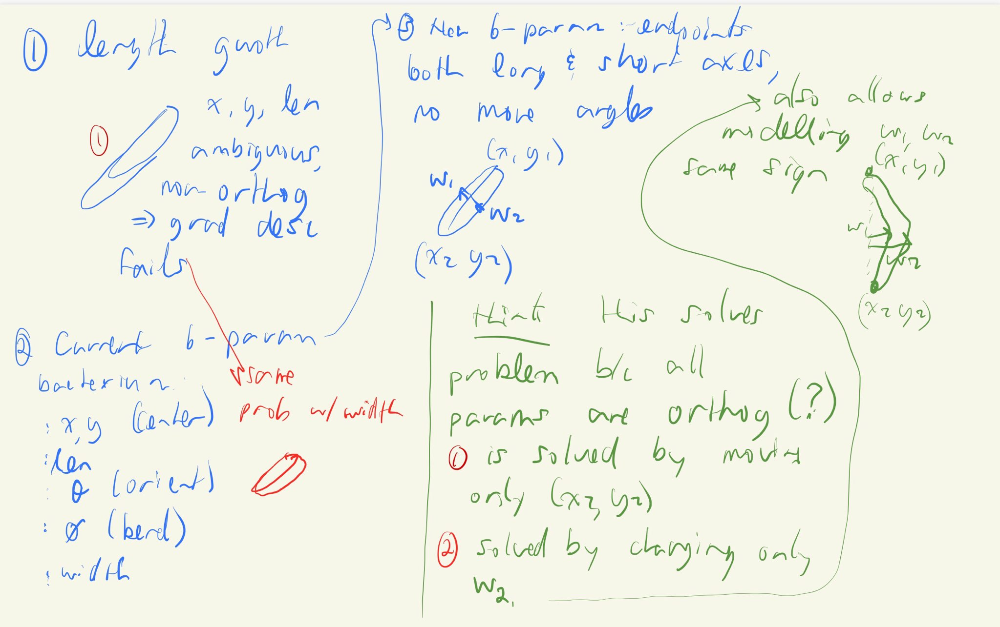

# 2D Gradient Descent Prototype

2D gradient descent optimizer treats the objective function as a multivariate function with 5 parameters: x, y, rotation, width, length. By perturbing these parameters by a small amount, we can obtain the numerical gradient of the objective function and perform gradient descent. The prototype uses backtrack line search for finding the step size. Nevertheless, the prototype is inherently flawed given that the parameters are not orthogonal to each other e.g. x, y and length. The exhibited problem is shown in the **Problem** section. 
## Quickstart:

1. Install Pipenv
```bash
$ pip install pipenv
```

2. Install required packages using Pipenv
```bash
$ cd 2d/gradient_descent_prototype && pipenv install
```
This will create a virtual environment with all the required Python packages

3. Activate Pipenv environment
```bash
$ pipenv shell
```
4. Change directory to the example folder
```
cd video0/canonical
```
5. Use the script to run the example

For Windows Users (Powershell):
```
.\run.ps1
```
For Linux Users (Bash):
```
.\run.sh
```
## Problem:
The following problem occurs when the cell moves in y direction and grow in length at the same time. The current GD prototype won't be able to find the correct y position and then grow in length. Instead, it would converge to a local minimum and the synthetic cell would shrink at the corner of the real one. A feasible solution is proposed by defining 6 new orthogonal cell parameters.(Shown in the figure below)

